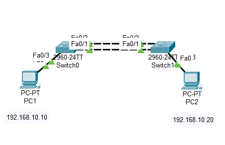
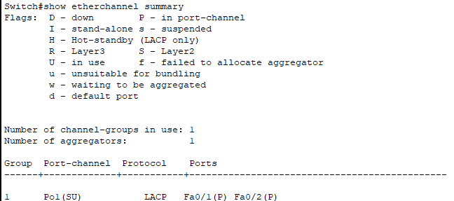
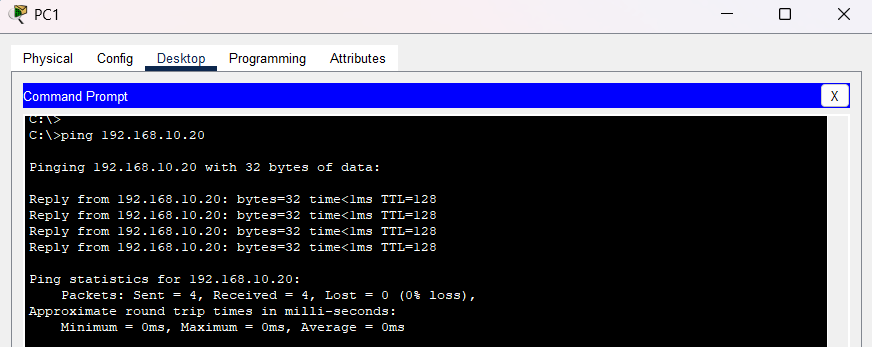

# Day 05 - EtherChannel (LACP)

## Objective
The objective of this lab was to configure EtherChannel using LACP between two switches to improve redundancy and network reliability.

---

# Topology



---

# Topics Covered
- EtherChannel
- LACP
- Trunk configuration
- Redundancy
- Failover testing
- Troubleshooting

---

# VLAN Configuration

| VLAN | Purpose |
|------|----------|
| 10 | Users |

---

# PC Addressing

| Device | IP Address |
|--------|------------|
| PC1 | 192.168.10.10 |
| PC2 | 192.168.10.20 |

---

# EtherChannel Configuration

## Switch1

```bash
interface range fa0/1 - 2
switchport mode trunk
channel-group 1 mode active

interface port-channel 1
switchport mode trunk
```

## Switch2

```bash
interface range fa0/1 - 2
switchport mode trunk
channel-group 1 mode active

interface port-channel 1
switchport mode trunk
```

---

# EtherChannel Verification

Command used:

```bash
show etherchannel summary
```

## Verification Output



---

# Connectivity Testing

Successful ping between PCs:


---

# Failover Testing

One EtherChannel link was disconnected to test redundancy.

The network remained operational using the remaining active link.



---

# Troubleshooting

## Issue
EtherChannel link failure (red status lights) after re-inserting a physical cable. Even though the configuration was correct, the switch "suspended" the port when the cable was reconnected, preventing it from joining the logical bundle.


## Cause
Protocol Desynchronization.
When the cable was plugged back in, the Spanning Tree Protocol (STP) detected a potential loop before the Link Aggregation Control Protocol (LACP) could complete its "handshake." To protect the network, the switch put the port into an error state to prevent a broadcast storm.

## Fix
Force a Protocol Reset.
Applied a shutdown followed by a no shutdown on the physical interface range. This forced both switches to restart the negotiation process simultaneously, allowing the port to successfully join the Port-Channel bundle

---

# What I Learned
- How EtherChannel combines multiple links into one logical connection
- How LACP negotiates EtherChannel formation
- How redundancy improves reliability
- Basic EtherChannel troubleshooting techniques

---

# Files Included
- Packet Tracer lab
- Configuration file
- Verification screenshots
