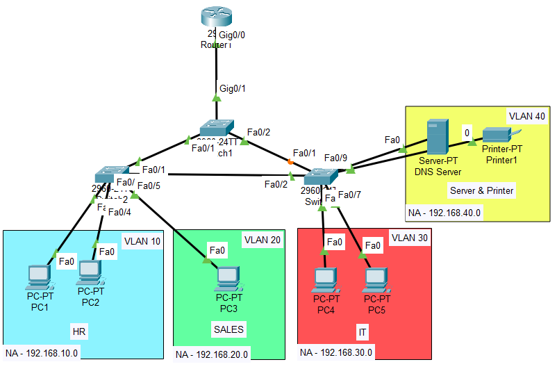
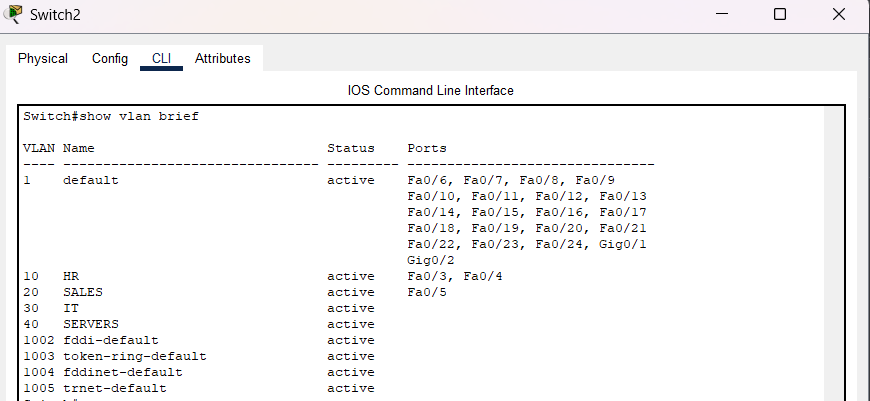
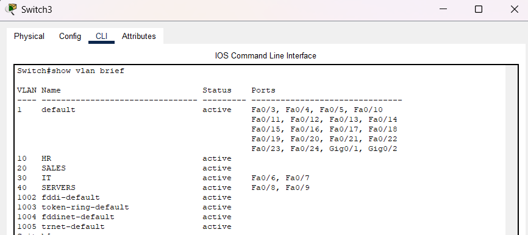
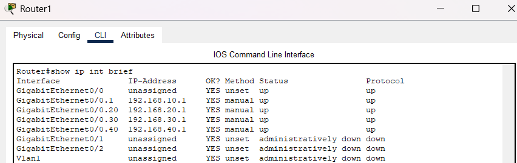
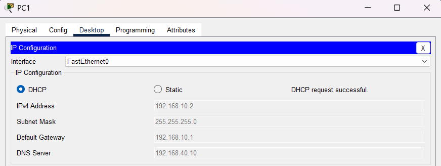
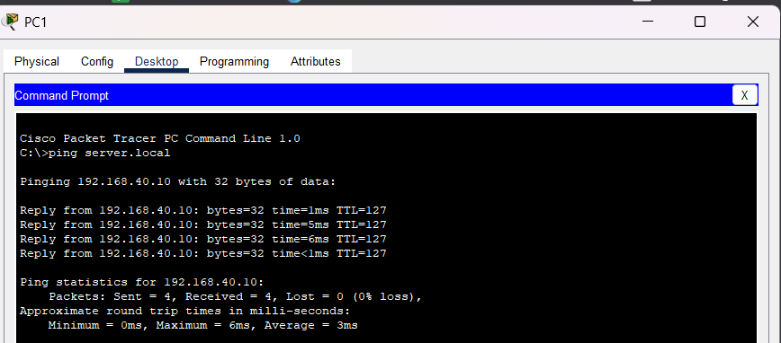
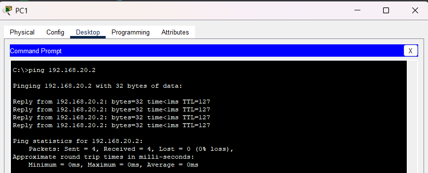

# Small Enterprise Office Network

## Objective
The objective of this lab was to design and configure a small enterprise-style office network integrating VLAN segmentation, inter-VLAN routing, DHCP, DNS, trunking, STP, and redundant switching.

---

# Topology



---

# Network Overview

This network was designed to simulate a small enterprise office environment with multiple departments, centralized services, and redundant switching paths.

The topology includes:
- Multiple VLANs
- Inter-VLAN routing
- DHCP services
- DNS services
- Redundant switch connections
- STP loop prevention
- Shared network resources

---

# VLAN Structure

| VLAN | Department | Devices |
|------|-------------|----------|
| 10 | HR | PC1, PC2 |
| 20 | Sales | PC3 |
| 30 | IT | PC4, PC5 |
| 40 | Servers | Server, Printer |

---

# IP Addressing

| VLAN | Network | Gateway |
|------|----------|----------|
| 10 | 192.168.10.0/24 | 192.168.10.1 |
| 20 | 192.168.20.0/24 | 192.168.20.1 |
| 30 | 192.168.30.0/24 | 192.168.30.1 |
| 40 | 192.168.40.0/24 | 192.168.40.1 |

---

# VLAN Configuration

```bash
vlan 10
name HR

vlan 20
name SALES

vlan 30
name IT

vlan 40
name SERVERS
```




---

# Trunk Configuration

Configured trunk links between switches and the router connection to carry traffic for multiple VLANs.

```bash
interface fa0/1
switchport mode trunk
```

---

# Inter-VLAN Routing

Configured router-on-a-stick using subinterfaces for communication between VLANs.

```bash
interface g0/0.10
encapsulation dot1Q 10
ip address 192.168.10.1 255.255.255.0
```



---

# DHCP Configuration

Configured DHCP pools for automatic IP address assignment to client devices.



---

# DNS Configuration

Configured the server as a DNS server for hostname resolution within the network.

Example:

```text
server.local → 192.168.40.10
```



---

# STP & Redundancy

Redundant switch links were configured to improve network reliability while STP prevented Layer 2 loops.

```bash
show spanning-tree
```
# Failover Testing

A redundant link failure was simulated and network connectivity remained operational through backup paths.



---

# Troubleshooting

## Issues Tested
- Incorrect VLAN assignments
- Trunk misconfigurations
- DHCP issues
- Redundant link failures

## Resolution
Verified VLAN assignments, trunk states, routing configurations, and DHCP settings using switch and router verification commands.

---

# What I Learned
- How enterprise VLAN segmentation works
- How inter-VLAN routing integrates multiple departments
- How DHCP and DNS services operate in enterprise environments
- How STP prevents switching loops
- How redundancy improves network reliability
- Basic enterprise network troubleshooting techniques

---

# Files Included
- Packet Tracer lab
- Configuration file
- Verification screenshots
- Troubleshooting screenshots
