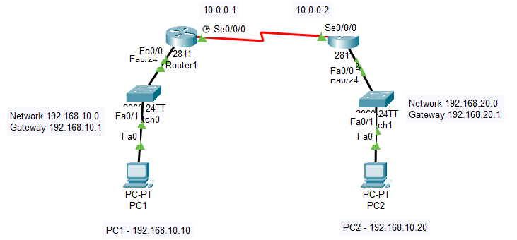
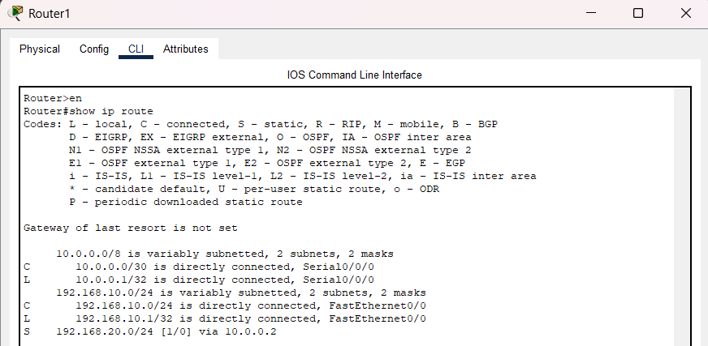
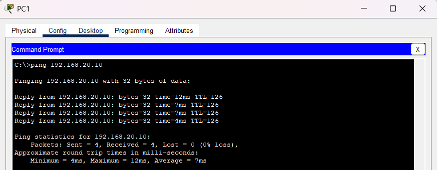
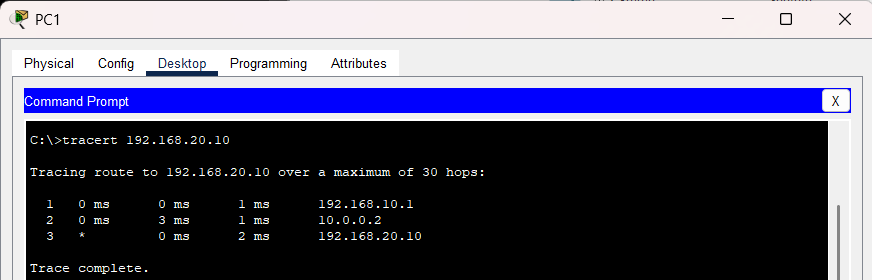

# Static Routing

## Objective
The objective of this lab was to configure static routing between two routers to enable communication between separate LAN networks across a WAN connection.

---

# Topology



---

# Network Overview

This lab simulated communication between a Head Office and a Branch Office using static routing.

The topology included:
- Two routers
- Two LAN segments
- A serial WAN connection
- Static route configuration
- Routing verification and troubleshooting

---

# IP Addressing

| Device | Interface | IP Address |
|--------|-----------|------------|
| PC1 | Fa0 | 192.168.10.10 |
| Router1 | Fa0/0 | 192.168.10.1 |
| Router1 | S0/0/0 | 10.0.0.1 |
| Router2 | S0/0/0 | 10.0.0.2 |
| Router2 | Fa0/0 | 192.168.20.1 |
| PC2 | Fa0 | 192.168.20.10 |

---

# Router1 Configuration

```bash
interface Fa0/0
ip address 192.168.10.1 255.255.255.0
no shutdown

interface s0/0/0
ip address 10.0.0.1 255.255.255.252
clock rate 64000
no shutdown

ip route 192.168.20.0 255.255.255.0 10.0.0.2

```
---

# Router2 Configuration

```bash
interface Fa0/0
ip address 192.168.20.1 255.255.255.0
no shutdown

interface s0/0/0
ip address 10.0.0.2 255.255.255.252
no shutdown

ip route 192.168.10.0 255.255.255.0 10.0.0.1
```
---
# Routing Verification

Used routing table verification commands to confirm that both routers successfully learned remote network paths.

```bash
show ip route
```



---

# Connectivity Testing

Verified successful communication between remote LAN networks using ping tests.



---

# Traceroute Testing

Used traceroute to observe packet traversal through routers across the WAN connection.



---

# Troubleshooting

## Issues Tested
- Incorrect next-hop addresses
- Interface shutdown states
- Missing static routes
- Incorrect subnet masks

## Resolution
Verified routing tables, interface states, and route configurations using router verification commands.


---

# What I Learned
- How routers communicate between remote networks
- How static routing works
- How routing tables are built
- Difference between directly connected and remote networks
- Basic WAN troubleshooting techniques

---

# Files Included
- Packet Tracer lab
- Configuration file
- Verification screenshots
- Troubleshooting screenshots
