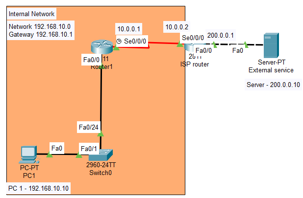
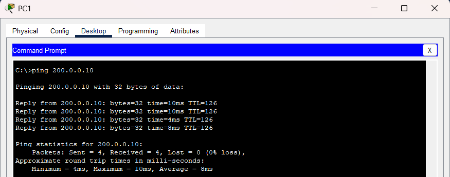
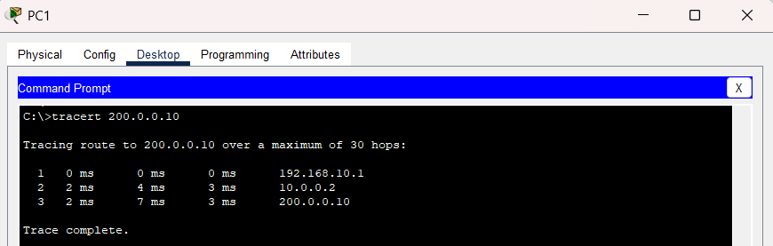

#Default Routing

## Objective
The objective of this lab was to configure default routing between a branch office router and an ISP router to simulate internet-style connectivity between internal and external networks.

---

# Topology



---

# Network Scenario

This lab simulated a small branch office network accessing external resources through an ISP router using a default route.

The topology included:
- A branch office LAN
- A WAN serial connection
- An ISP router
- A simulated internet server
- Default route configuration
- Routing verification and troubleshooting

---

# IP Addressing

| Device | Interface | IP Address |
|--------|-----------|------------|
| PC1 | Fa0 | 192.168.10.10 |
| Router1 | Fa0/0 | 192.168.10.1 |
| Router1 | S0/0/0 | 10.0.0.1 |
| Router2 | S0/0/0 | 10.0.0.2 |
| Router2 | Fa0/0 | 200.0.0.1 |
| Server | Fa0 | 200.0.0.10 |

---

# Router1 Configuration

```bash
interface Fa0/0
ip address 192.168.10.1 255.255.255.0
no shutdown

interface s0/0/0
ip address 10.0.0.1 255.255.255.252
clock rate 64000
no shutdown

ip route 0.0.0.0 0.0.0.0 10.0.0.2
```


# Router2 Configuration

```bash
interface s0/0/0
ip address 10.0.0.2 255.255.255.252
no shutdown

interface Fa0/0
ip address 200.0.0.1 255.255.255.0
no shutdown

ip route 192.168.10.0 255.255.255.0 10.0.0.1
```


# Gateway of Last Resort

Configured a default route on Router1 to forward unknown traffic toward the ISP router.

```bash
ip route 0.0.0.0 0.0.0.0 10.0.0.2
```


---

# Connectivity Testing

Verified successful communication between the branch office LAN and the simulated internet server.



---

# Traceroute Verification

Used traceroute to observe packet traversal through multiple routers before reaching the destination server.



---

# Troubleshooting

## Issues Tested
- Missing default route
- Missing return route
- Incorrect next-hop addresses
- WAN interface failures

## Resolution
Verified routing tables, interface states, and route configurations using router verification commands.

---

# What I Learned
- How default routing works
- What Gateway of Last Resort means
- How routers forward unknown traffic
- How branch offices communicate with external networks
- Why return routes are important
- Basic WAN troubleshooting techniques

---

# Files Included
- Packet Tracer lab
- Configuration commands
- Verification screenshots
