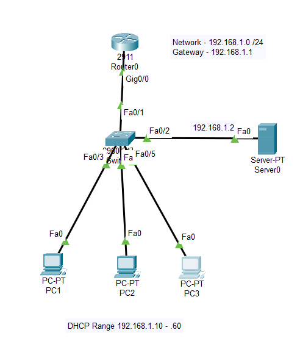
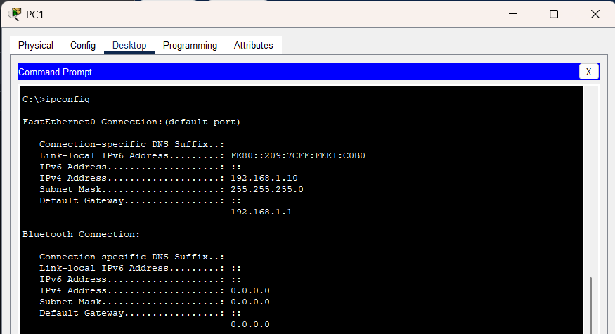
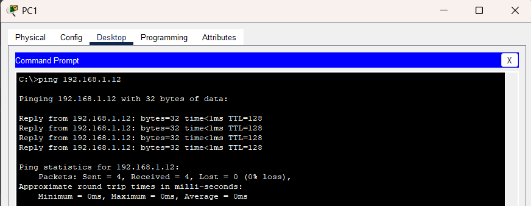

# DHCP Lab - Small Office Network

## 📌 Objective
To implement dynamic IP address assignment using a DHCP server in a small office network.

## 🧱 Topology
- 1 Router (Gateway)
- 1 Switch
- 1 Server (DHCP)
- 3 Client PCs

## 🌐 Network Design
- Network: 192.168.1.0/24
- Gateway: 192.168.1.1
- DHCP Server: 192.168.1.2

## ⚙️ Configuration Summary

### Router
- Configured as default gateway for the network

### Server
- Assigned static IP
- Enabled DHCP service
- Configured IP pool for dynamic assignment

### Clients
- Configured to obtain IP automatically via DHCP

## 🧪 Testing

### IP Assignment

- Devices successfully received IP addresses dynamically

### Connectivity Test

- Verified communication between devices

## 🔧 Troubleshooting

### Issue:

-Devices received IP addresses but default gateway was missing

### Cause:
Conflict with default DHCP pool ("Server Pool")

### Fix:
Disabled default pool and configured custom DHCP pool correctly

## 📚 Key Learnings
- DHCP automates IP configuration in networks  
- Proper gateway configuration is critical  
- Multiple DHCP pools can cause conflicts  

## ✅ Result
Successfully implemented a DHCP-based network with dynamic IP assignment.
