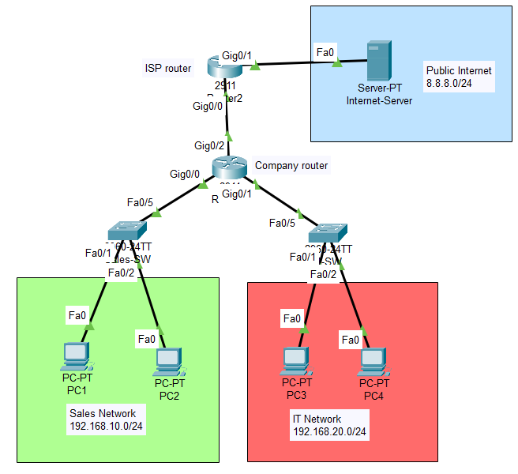
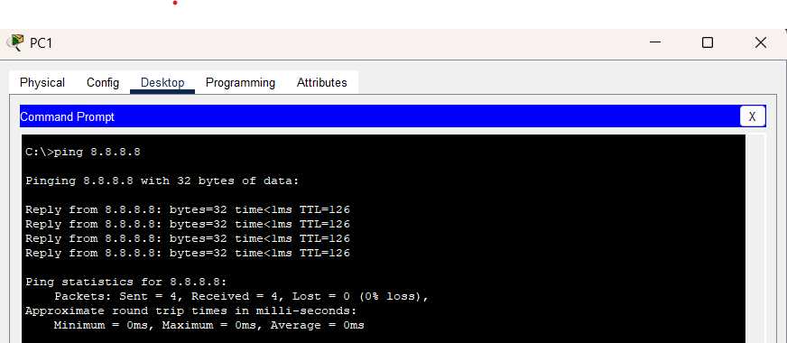
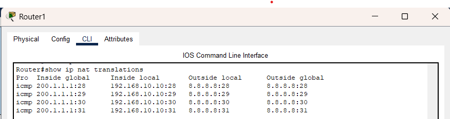

# Enterprise NAT/PAT Internet Access Lab

## 📌 Objective
To simulate enterprise internet access using NAT/PAT and allow multiple internal networks to communicate with an external public network using a single public IP address.

---

## 🧱 Topology
- 2 Routers
- 2 Switches
- 4 Client PCs
- 1 Internet Server 

---

## 🌐 Network Design

| Network | Address Range |
|---|---|
| Sales Department | 192.168.10.0/24 |
| IT Department | 192.168.20.0/24 |
| Company ↔ ISP Link | 200.1.1.0/30 |
| Public Internet Network | 8.8.8.0/24 |

---

## ⚙️ Configuration Summary

### Company Router
- Configured internal and external interfaces
- Applied NAT inside/outside configuration
- Configured PAT overload 
- Added default route toward ISP

### ISP Router
- Simulated internet provider
- Routed traffic back to internal networks

### Internet Server
- Simulated external public service

---

## 🧪 Testing

### Internet Connectivity

- Internal devices successfully reached external server

### NAT Translation Table

- Verified translation of private IPs into public IP address

---

## 🔧 Troubleshooting

### Issue
NAT translations were not appearing.

### Cause
Traffic had not yet triggered dynamic NAT translation or NAT inside/outside configuration was incomplete.

### Fix
- Generated traffic using ping
- Verified NAT inside/outside assignments
- Confirmed ACL matching and PAT configuration

---

## 📁 Configuration Files

- configs/company-router-config.txt
- configs/isp-router-config.txt

---

## 📚 Key Learnings

- Learned the difference between private and public IP addressing  
- Understood how NAT translates internal private addresses into public addresses  
- Learned how PAT allows multiple devices to share a single public IP address  
- Explored inside vs outside NAT interfaces  
- Understood how ACLs are used in NAT to identify traffic for translation  
- Learned that NAT translations are dynamically created when traffic flows  
- Simulated enterprise internet access using router-based translation  

---

## ✅ Result

Successfully implemented enterprise-style internet access using NAT/PAT with multiple internal networks sharing a single public IP address.
