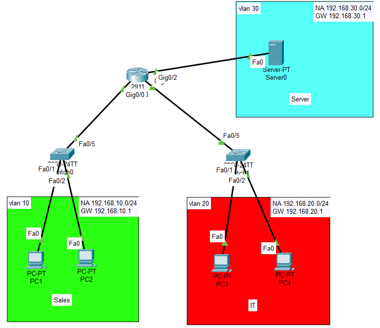
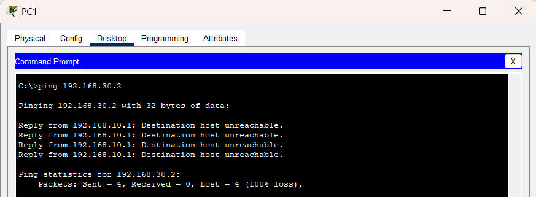
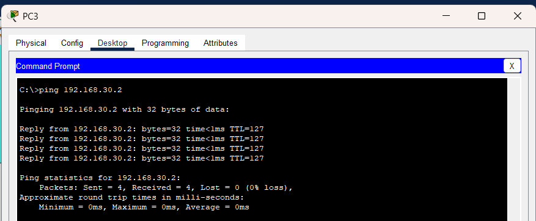
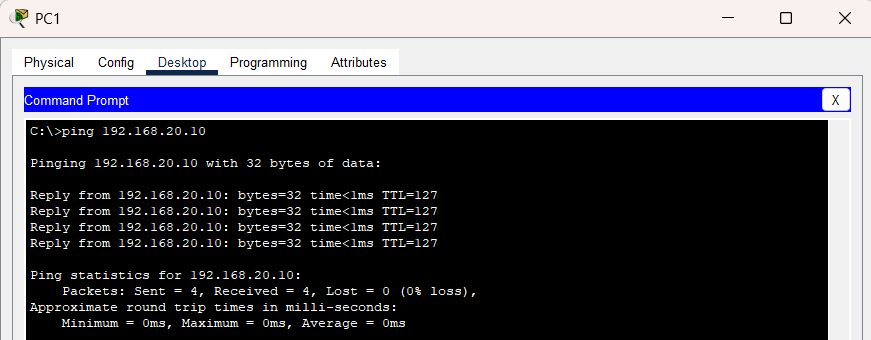

# Interdepartment Access Control Lab

## 📌 Objective
To implement Access Control Lists (ACLs) to enforce communication restrictions between departments in a small office network.

## 🧱 Topology
- 1 Router
- 2 Switches
- 4 Client PCs
- 1 Internal Server

---

## 🌐 Network Design

| Department | Network |
|---|---|
| Sales Department | 192.168.10.0/24 |
| IT Department | 192.168.20.0/24 |
| Server Network | 192.168.30.0/24 |

---

## ⚙️ Configuration Summary

### Router
- Configured routing between multiple networks
- Applied Extended ACL rules to filter traffic

### Security Policy
- Sales department denied access to internal server
- IT department allowed access to internal server

---

## 🧪 Testing

### Sales Department Access

- Sales users were unable to access the internal server

### IT Department Access

- IT users successfully accessed the internal server

### Sales to IT Department Access

---

## 🔧 Troubleshooting

### Issue
All traffic became blocked after ACL implementation.

### Cause
Missing permit rule in the ACL configuration.

### Fix
Added:
permit ip any any

---

## 📁 Configuration Files

Router configuration available in:
configs/router-config.txt

---

## 📚 Key Learnings

- Learned the difference between Standard ACLs and Extended ACLs  
- Understood how Extended ACLs filter traffic using both source and destination networks  
- Explored how ACL rules are processed sequentially from top to bottom  
- Learned about the implicit deny rule and why `permit ip any any` is important  
- Understood why Extended ACLs are placed close to the source network  
- Gained better understanding of inbound ACL processing and traffic filtering  
- Implemented department-level access restrictions to simulate real organizational security policies  

---

## ✅ Result

Successfully implemented interdepartment access control using Extended ACLs.
