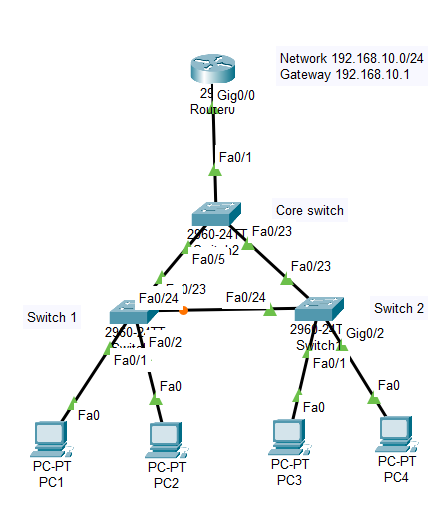
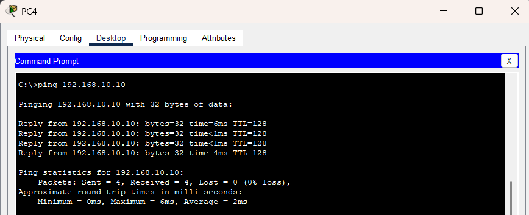
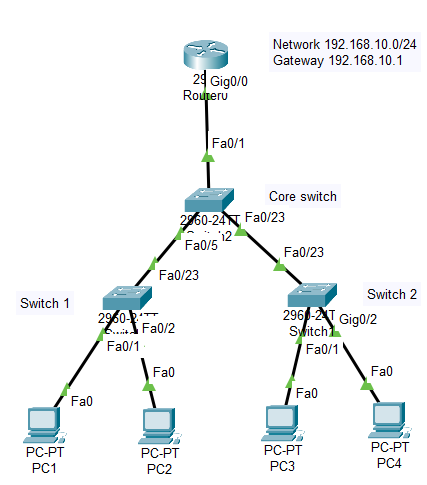
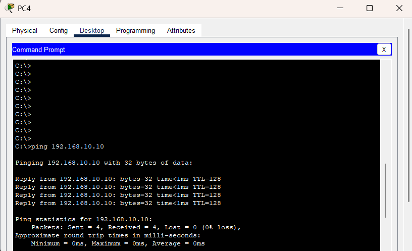

# Redundant Switch Network Lab

## 📌 Objective
To design a redundant switch topology that maintains network connectivity even when a primary communication path fails.

---

## 🧱 Topology
- 1 Router
- 3 Switches
- 4 Client PCs

---

## 🌐 Network Design

| Device Group | Network |
|---|---|
| Internal LAN | 192.168.10.0/24 |

---

## ⚙️ Configuration Summary

### Router
- Configured default gateway for internal LAN

### Switch Infrastructure
- Implemented interconnected switch topology
- Created primary and backup communication paths

### End Devices
- Configured all devices within the same LAN

---

## 🧪 Testing

### Connectivity Before Failover

- Devices communicated normally through primary path

### Simulated Link Failure

- Primary uplink between Core Switch and Access Switch 2 was disconnected

### Connectivity After Failover

- Network communication continued through alternate switch path after STP recalculation

---

## 🔧 Troubleshooting

### Issue
Connectivity temporarily failed after disconnecting a switch link.

### Cause
Spanning Tree Protocol required time to recalculate the topology and activate the backup path.

### Fix
Allowed time for STP convergence and verified alternate switch path connectivity.

---

## 📁 Configuration Files

- configs/router-config.txt

---

## 📚 Key Learnings

- Learned the importance of redundancy in network design  
- Understood how backup communication paths improve network resilience  
- Observed failover behavior during link failure scenarios  
- Gained practical understanding of how switches adapt to topology changes  
- Explored basic Spanning Tree Protocol (STP) convergence behavior  
- Learned that resilient networks require alternate valid communication paths rather than just additional cables  

---

## ✅ Result

Successfully implemented a redundant switch topology capable of maintaining connectivity during a simulated link failure.
