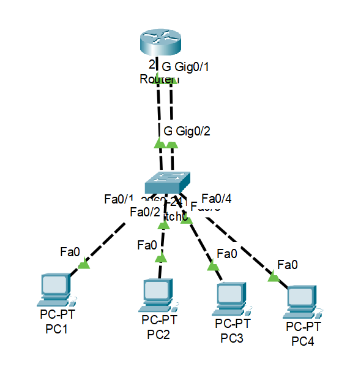
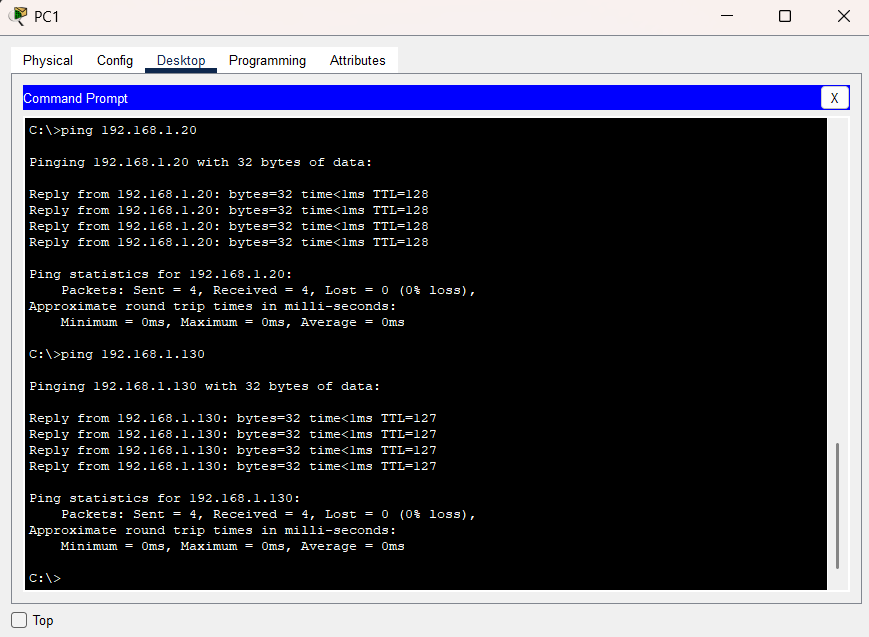

# Subnetting Lab - Basic Network Segmentation

## 📌 Objective
To design and configure a network divided into two subnets and enable communication between them using a router.

## 🧱 Topology
- 1 Router
- 1 Switch
- 4 PCs

## 🌐 Subnet Design

### Subnet 1
- Network: 192.168.1.0/25
- Range: 192.168.1.1 – 192.168.1.126
- Gateway: 192.168.1.1

### Subnet 2
- Network: 192.168.1.128/25
- Range: 192.168.1.129 – 192.168.1.254
- Gateway: 192.168.1.129

## ⚙️ Configuration Summary

### Router Interfaces
- G0/0 → 192.168.1.1 /25
- G0/1 → 192.168.1.129 /25

### PCs
- Subnet 1: PC1, PC2
- Subnet 2: PC3, PC4

## 🧪 Testing

### Successful Communication

- Same subnet communication: SUCCESS  
- Inter-subnet communication via router: SUCCESS  

## 🔧 Troubleshooting

### Issue:
Ping failed due to incorrect default gateway

### Fix:
Corrected gateway IP and restored connectivity

## 📚 Key Learnings
- Subnetting divides networks into smaller segments  
- Router enables communication between subnets  
- Default gateway is critical for inter-network communication  

## ✅ Result
Successfully implemented subnetting and routing between two networks.
