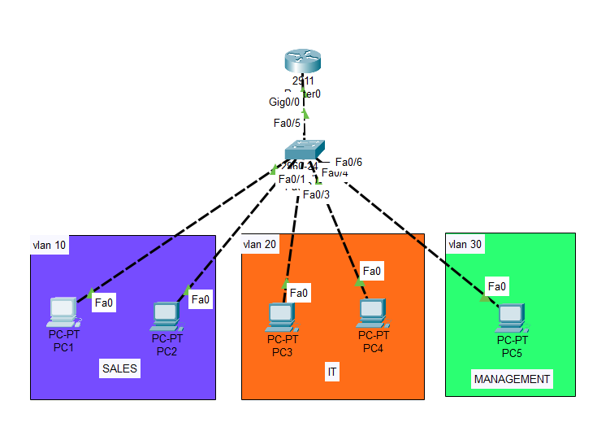
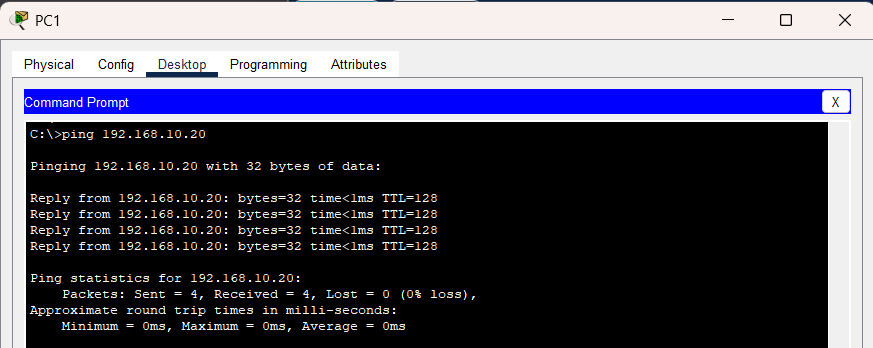
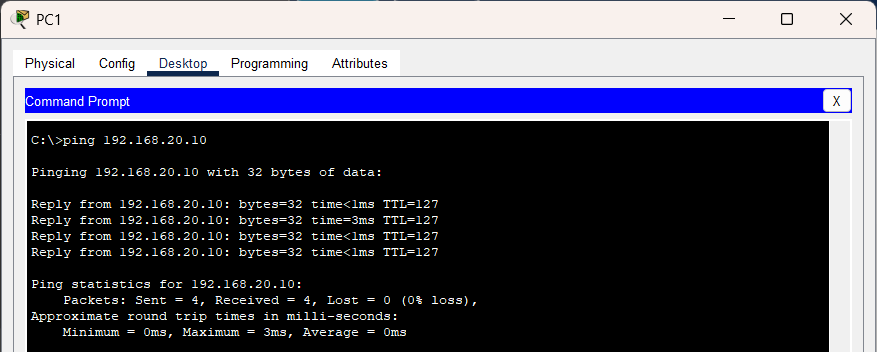

# VLAN Lab - Router-on-a-Stick (Inter-VLAN Routing)

## 📌 Objective
To implement VLAN-based network segmentation and enable communication between VLANs using router-on-a-stick.

## 🧱 Topology
- 1 Router
- 1 Switch
- 5 PCs

## 🌐 VLAN Design

| VLAN | Name | Network |
|------|------|--------|
| 10 | SALES | 192.168.10.0/24 |
| 20 | IT | 192.168.20.0/24 |
| 30 | MGMT | 192.168.30.0/24 |

## ⚙️ Configuration Summary

### Switch
- Created VLANs 10, 20, 30
- Assigned ports to VLANs
- Configured trunk link to router

### Router
- Configured subinterfaces for each VLAN
- Enabled inter-VLAN routing using dot1Q encapsulation

## 🧪 Testing

### Successful Communication

- Same VLAN communication: SUCCESS
  
  
- Inter-VLAN communication via router: SUCCESS
-   

## 🔧 Troubleshooting

### Issue:
Inter-VLAN communication failed due to missing trunk configuration

### Cause:
Switch port connected to router was not configured as a trunk, preventing VLAN traffic from reaching the router

### Fix:
Configured trunk using:
switchport mode trunk

### Result:
Inter-VLAN communication restored successfully

## 📚 Key Learnings
- VLANs provide logical network segmentation  
- Trunk links carry multiple VLANs  
- Router-on-a-stick enables inter-VLAN routing  
- Proper gateway configuration is critical  

## ✅ Result
Successfully implemented VLAN segmentation and inter-VLAN communication.
